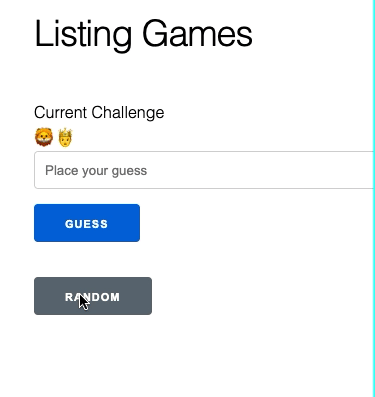

# Phoenix Emoji Game

🤔❓✅

A game for guesing what the emojis mean.

This was built for learning purposes during during a [Triangle Elixir Meetup](https://www.meetup.com/Triangle-Elixir/).

It was built to see how to leverage [Phoenix LiveView](https://github.com/phoenixframework/phoenix_live_view).

## Development

To start your Phoenix server:

  * Install dependencies with `mix deps.get`
  * Create and migrate your database with `mix ecto.setup`
  * Install Node.js dependencies with `npm install` inside the `assets` directory
  * Start Phoenix endpoint with `mix phx.server`

Now you can visit [`localhost:4000`](http://localhost:4000) from your browser.